## Automated DVWA and ELK Stack Deployment

The files in this repository were used to configure the Azure resource group depicted below. There are two networks contained in this resource group and each network has its own security group (firewall). The access rules listed at the top of the stack have the highest priority and overwrite all rules below it. Network peering has been used to allow communication between the red and purple v-networks as indicated in the diagram.

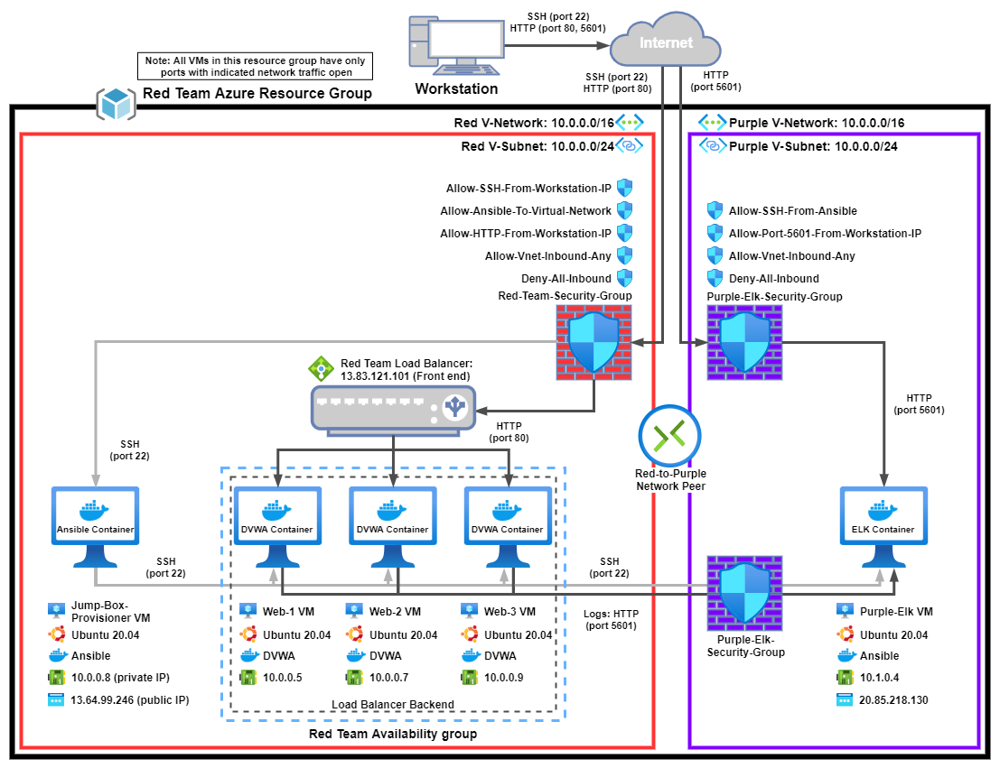

These files have been tested and used to generate live DVWA and ELK deployments on Azure. They can be used to recreate the entire deployment pictured above. Alternatively, select portions of the [elk-main.yml](./ansible/elk-main.yml) file may be used to install only certain pieces of it, such as Filebeat with the command:

  ```bash
  ansible-playbook elk-main.yml -t filebeat
  ```

This document contains the following details:
- Description of the Topology
- Access Policies
- DVWA Configuration
- ELK Configuration
  - Beats in Use
  - Machines Being Monitored
- Understanding Ansible
- How to Use the Ansible Build
  - Using the Playbooks
  - Clone the repository
  - Update the hosts file
  - Install DVWA containers to Web VMs
  - Install Basic ELK Stack
  - Install Filebeat and Metricbeat
- Bonus: "Attack" your Web VMs

### Description of the Topology

The main purpose of this network is to expose a load-balanced and monitored instance of DVWA, the D*mn Vulnerable Web Application.

Load balancing ensures that the application will be highly available, in addition to restricting access to the network.
- Load balancers protect the system from (D)DoS attacks by shifting attack traffic. The advantage of a jump box is to give access to the user from a single node that can be secured and monitored

Integrating an ELK server allows users to easily monitor the vulnerable VMs for changes to the logs and system traffic.
- Filebeat is used to forward log data from the Web VMs to the ELK VM
- Metricbeat is used to monitor system traffic

The configuration details of each machine may be found below.

|   Virtual Box Name   	| Azure VM Size 	|     Operating System    	| Container 	|     Function    	|          IP Address         	|
|:--------------------:	|:-------------:	|:-----------------------:	|:---------:	|:---------------:	|:---------------------------:	|
| Jump-Box-Provisioner 	|  Standard_B1s 	| Ubuntu Server 20.04 LTS 	|  Ansible  	|     Gateway     	|  13.64.99.246<br />10.0.0.4 	|
|         Web-1        	| Standard_B1ms 	| Ubuntu Server 20.04 LTS 	|    DVWA   	|      Server     	|           10.0.0.5          	|
|         Web-2        	| Standard_B1ms 	| Ubuntu Server 20.04 LTS 	|    DVWA   	|      Server     	|           10.0.0.7          	|
|         Web-3        	| Standard_B1ms 	| Ubuntu Server 20.04 LTS 	|    DVWA   	|      Server     	|           10.0.0.9          	|
|      Purple-Elk      	| Standard_B2ms 	| Ubuntu Server 20.04 LTS 	| ELK Stack 	| Network Monitor 	| 20.85.218.130<br />10.1.0.4 	|

### Access Policies

The machines on the internal network are not exposed to the public Internet. 

Only the Jumpbox machine can accept SSH connections from the Internet. Access to this machine is only allowed from `$my-home-ip-address` (this represents my public IP address. I won't be sharing it here)

Machines within the network can only be accessed by Jumpbox from its private IP address of 10.0.0.4.

A summary of the access policies in place can be found in the table below.

|      Virtual Box     	|     Publicly Accessible  	|  Allowed IP Address 	|
|:--------------------:	|:------------------------: |:-------------------:	|
| Jump-Box-Provisioner 	|          Yes     	        | $my_home_ip_address 	|
|         Web-1        	|          No             	|       10.0.0.4      	|
|         Web-2        	|          No              	|       10.0.0.4      	|
|         Web-3        	|          No               |       10.0.0.4      	|
|      Purple-Elk      	|          No               |       10.0.0.4      	|

### DVWA Configuration

Ansible was used to automate the installation of the DVWA containers across all three Web VMs. This is done mainly for speed and consistency so that each container can be up and running with one command. 

The [dvwa-main.yml](./ansible/dvwa-main.yml) implements the following tasks:
- Install Docker to Web VMs
  - install docker.io with apt
  - install python3-pip with apt
  - use pip to install docker
  - enable docker services on boot
- Install DVWA to Web VMs
  - pull docker image cyberxsecurity/dvwa
  - start the container
  - set to always restart
  - publish ports: 80:80

Remember that DVWA is intentionally left vulnerable to test exploits against them and receive feedback through system motoring such as Filebeats and Metricbeats.

### Elk Configuration

Ansible was also used to automate configuration of the ELK machine. No configuration was performed manually. This is advantageous because it ensures there were no user errors while deploying ELK as well as providing documentation for the configuration


The [elk-main.yml](./ansible/elk-main.yml) playbook implements the following tasks:
- Install Docker to Purple-Elk VM
  - install docker.io with apt
  - install python3-pip with apt
  - use pip to install docker 
  - enable docker service on boot
- Install ELK to Purple-Elk VM
  - Increase the virtual memory with sysctl
  - Increase max memory usage
  - Install ELK container
    - pull docker image sebp/elk
    - start the container
    - set to always restart
    - publish ports:
      - 5601:5601
      - 9200:9200
      - 5044:5044
- Install Filebeat to Web VMs
  - download filebeat
  - install filebeat
  - copy filebeat configuration from ansible container to Web VM
  - set up filebeat
  - start filebeat
  - enable filebeat service on boot
- Install Metricbeat to the Web VMs
  - download metricbeat
  - install metricbeat
  - copy metricbeat configuration from ansible container to Web VM
  - set up metricbeat
  - start metricbeat
  - enable metribeat service on boot

### Target Machines & Beats

This ELK server is configured to monitor the following machines:
- Web-1 VM : DVWA Container : 10.0.0.5
- Web-2 VM : DVWA Container : 10.0.0.7
- Web-3 VM : DVWA Container : 10.0.0.9

We have installed the following Beats on these machines:
- Filebeat
- Metricbeat

These Beats allow us to collect the following information from each machine:
- Filebeat allows us to collect logs from each machine to view in Kibana
- Metricbeat allows us to see system resource usage for each VM

### Understanding Ansible

This Ansible configuration follows the documented best practices for playbooks, roles, tags, and file structure which are as follows:
  - Playbooks are concise and rely on roles and tags to achieve the desired outcomes.
    - Playbooks can include several roles and hosts combined.
    - Not all playbooks require the use of roles, but it does help with organization
  - Roles are small, specific tasks that are designed to be easily compiled into playbooks.
    - Roles are tasks that can be easily used across several playbooks so you do not have to re-write the same task several times across multiple playbooks.
    - Unlike playbooks, roles are normally not run directly, but they can be if necessary.
    - Most roles use the name `main.yml`. This is because playbooks automatically look for `main.yml` under the tasks folder contained by the role. (this is more clear below)
  - Tags are used so roles can be singled out in a playbook in case you do not want to run the entire playbook.
    - In this configuration tags are assigned per-playbook, but they can be assigned globally
    - Multiple tags can be assigned to roles, or the same tag assigned to multiple roles. 
    - This configuration is relatively simple so it does not require complex tagging or roles
  - Ansible's recommended file structure for simple deployments is as follows:
    ```
    /etc/ansible/
      ansible.cfg
      example-playbook-1.yml
      example-playbook-2.yml
      hosts

      roles/
        example-role-1/
          files/
            example-role-1-config
          tasks/
            main.yml
        example-role-2/
          tasks/
            main.yml
    ```
    - Note that not all roles require a "files" folder
    - Ansible supports almost any file structure the user prefers, but Ansible is easiest to use with a structure like this.

### Using the Playbooks

In order to use these playbooks, you will need to have an Ansible control node already configured and VMs created for the web hosts and Elk. Playbooks have been provided to install DVWA on each Web VM and the ELK stack on the purple-elk VM.

### Clone the repository

SSH into the control node and follow the steps below:
- Clone this repo with:
  ```bash
  git clone https://github.com/sower-j/Cyber-Project-1.git
  ```
- Move the contents from `./Cyber-Project-1/ansible` to `/etc/ansible`

   ```bash
    mv ./Cyber-Project-1/ansible/* /etc/ansible/
   ```

  **WARNING: This command will overwrite everything your /etc/ansible folder. If you have playbooks, configuration files, or hosts you want to keep move files and folders over individually**

### Update hosts file

Navigate to the ansible directory:

  ```bash
  cd /etc/ansible
  ```

Update the hosts file to include your ELK VM and Web VMs' private IP addresses. If you only have 2 Web VMs remove the third line under ``[webservers]``
- for example:

  ```bash
  vi hosts
  ```

- use whatever text editor you prefer, nano will work just fine for this
- you will see hosts contains the following:

  ```bash
  [webservers]
  10.0.0.5 ansible_python_interpreter=/usr/bin/python3
  10.0.0.7 ansible_python_interpreter=/usr/bin/python3
  10.0.0.9 ansible_python_interpreter=/usr/bin/python3
  
  [elk]
  10.1.0.4 ansible_python_interpreter=/usr/bin/python3
  ```

- replace the IP addresses with those of your VMs

### Install DVWA containers to Web VMs

If you do not have DVWA containers on your Web VMs run the `dvwa-main.yml` with ansible

  ```bash
  ansible-playbook dvwa-main.yml
  ```

Once the playbook is complete you can check to see if your DVWA containers are running first by SSH into your Web VMs and running `sudo docker ps` and receiving the following output:

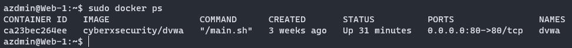

Second you can go to the public IP address of your Azure load balancer to verify the DVWA container is functioning.

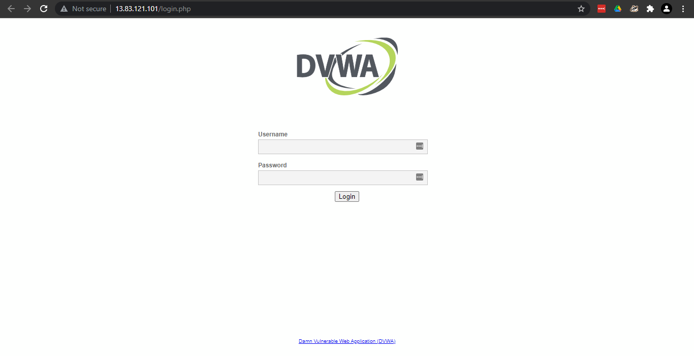

### Install Basic ELK Stack

Next install just the ELK stack to your ELK VM with the following command. This will not install filebeat or metricbeat. It is easier to make sure ELK is up and running before adding any monitoring.

  ```bash
  ansible-playbook elk-main.yml -t elk
  ```

Ensure the ELK container is running by SSH into your ELK VM and running `sudo docker ps` and receiving the following output:

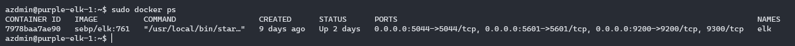

To see if Kibana is accessible to your public IP navigate to your ELK VM's public IP address followed by `$elk-vm-public-ip:5601/app/kibana` to get to the home page.

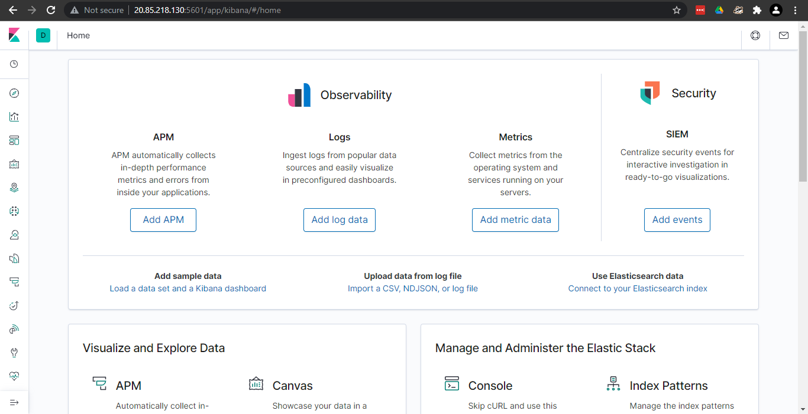

### Install Filebeat and Metricbeat

Before running the full ELK playbook you will need to update the Filebeat and Metricbeat configuration files to point to your ELK VM's private IP address.

  - Starting with the Filebeat configuration edit: 

    ``` bash
    /etc/ansible/roles/filebeat/files/filebeat-config.yml
    ```

  - Go to line `1106` where you will need to change the IP address to your ELK VM's private IP address next to `hosts:`. Do not change the port number, username, or password.

    ```bash
    hosts: ["10.1.0.4:9200"]
    username: "elastic"
    password: "changeme"
    ```

  - Next go to line `1806` and change the IP address to your ELK VM's private IP address next to `host:`. Once again do not change the port number.

    ```bash
    setup.kibana:
    host: "10.1.0.4:5601"
    ```

  - Moving on to the Metricbeat configuration edit:

    ```bash
    /etc/ansible/roles/metricbeat/files/metricbeat-config.yml
    ```

  - Go to line `62` and change the IP address to your ELK VM's private IP address, do not change the port number.

    ```bash
    setup.kibana:
    host: "10.1.0.4:5601"
    ```

  - Next go to line `96` and change the IP address to your ELK VM's private IP address next to `hosts:`. Do not change the port, username, or password.

    ```bash
    hosts: ["10.1.0.4:9200"]
    username: "elastic"
    password: "changeme"
    ```

Now you are ready to install Filebeat and Metricbeat to your Web VMs using the `elk-main.yml` playbook. You can do this two ways, both give you the same result:

  ```bash
  ansible-playbook elk-main.yml
  ```

or

  ```bash
  ansible-playbook elk-main.yml -t filebeat,metricbeat
  ```

Once Ansible is finished installing Filebeat and Metricbeat navigate back to your Kibana home page to enable the beats.

  - Starting with Filebeats click on `Add Log Data` on the main dashboard

    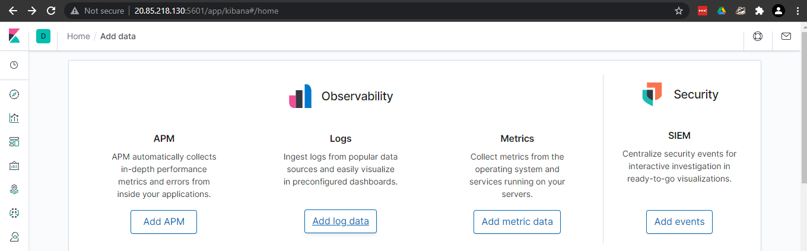

  - Choose `System Logs`
   
    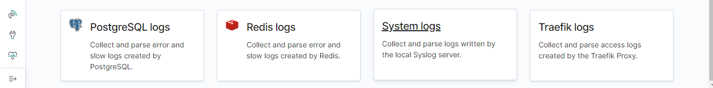

  - Click on the `DEB` tab under `Getting Started`
    - Note: Ansible has already done the installation steps for you, you can skip steps 1-4 on this page.

    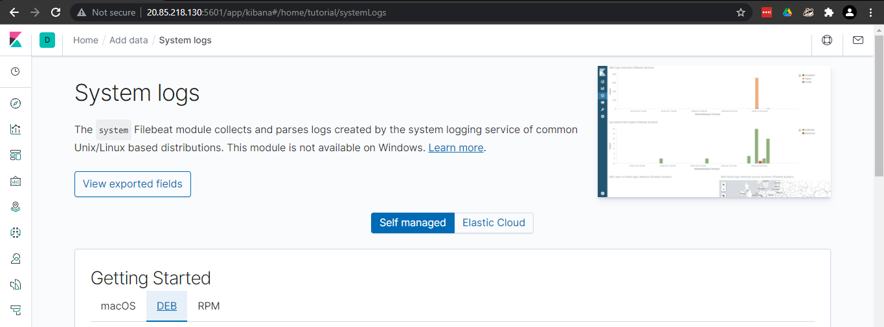

  - Scroll to the bottom of the page click `Check data` to ensure data is being received
  
    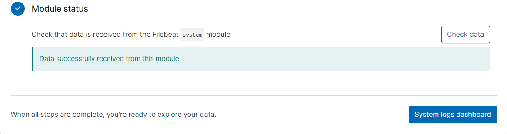

  - Finally click on the `System logs dashboard` button to be see your new dashboard.
    - Note: it is common to get an error warning the first time going to this dashboard, it is safe to ignore it

    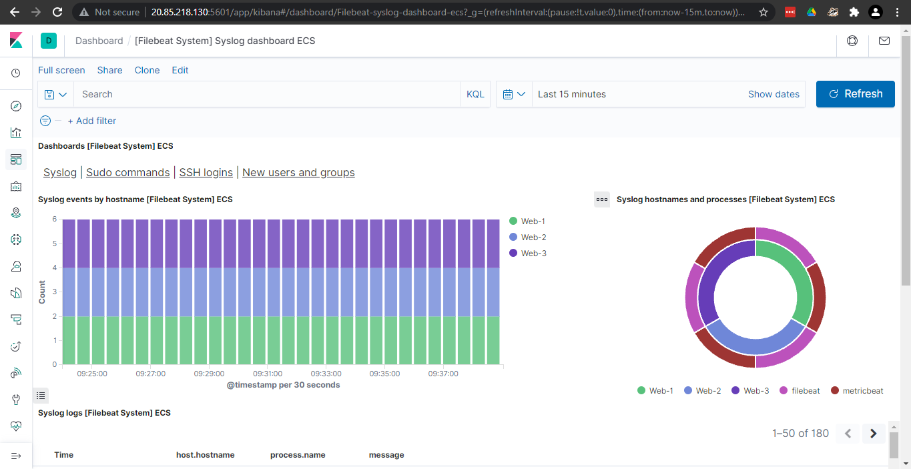

Now for Metricbeats

  - On the main dashboard click `Add metric data`

    

  - Choose `Docker metrics`
   
    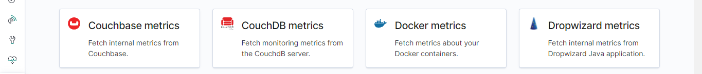

  - Click on the `DEB` tab under `Getting Started`
    - Note: Ansible has already done the installation steps for you, you can skip steps 1-4 on this page.

    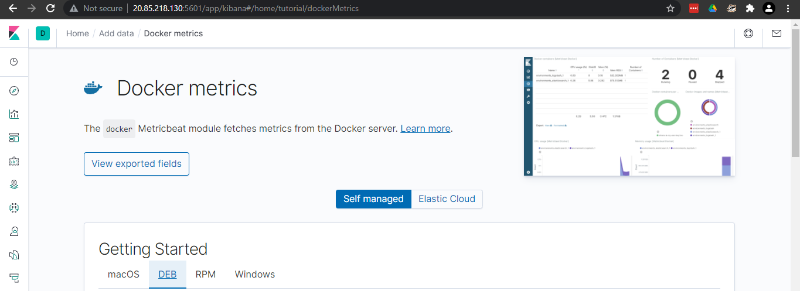

  - Scroll to the bottom of the page click `Check data` to ensure data is being received
  
    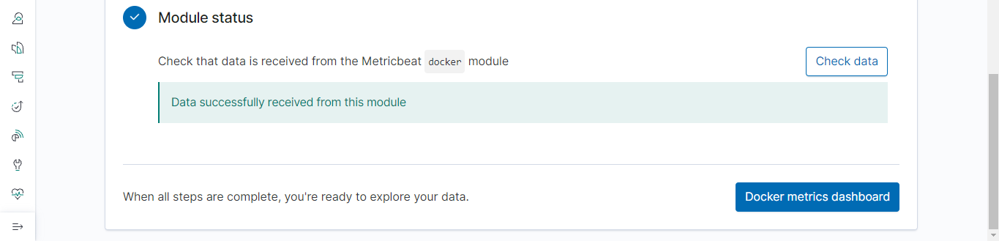

  - Finally click on the `Docker metrics dashboard` button to be see your new dashboard.
    - Note: it is common to get error warnings the first time going to this dashboard, it is safe to ignore them

    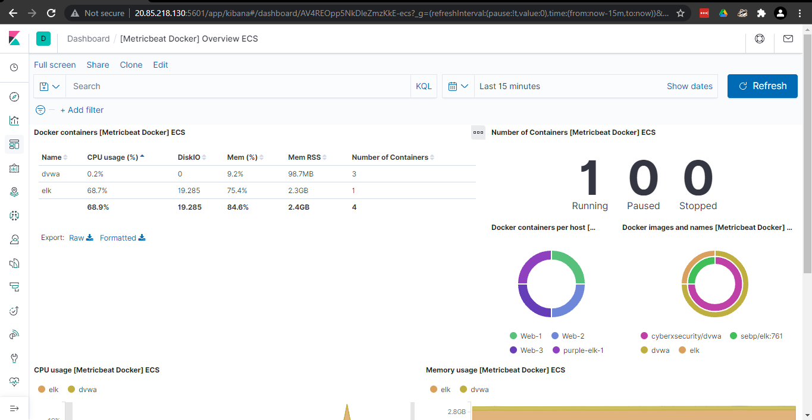

Congratulations! You have successfully duplicated this ELK stack configuration.
If you would like to learn more about navigating Kibana follow along with me in the [exploring-kibana](./exploring-kibana/README.md) section. This activity goes through some sample data to help you learn how to read and filter data with Kibana.

### Bonus: "Attack" your Web VMs

You may have noticed the `stress-test.yml` while installing your ELK stack. Now you get to use it! This playbook will install `stress` onto your Web VMs. Stress will max out your VM's CPU for an amount of time you choose so you can see the feedback in your Kibana metrics. Once the playbook is running you can choose the amount of time you want, I recommend 1-2 minutes. You can run the playbook with the following command:

  ```bash
  ansible-playbook stress.yml
  ```

Once the playbook is finished you can check Kibana to see the results.

  - Navigate to your Kibana home page and select `Metrics` on the left pane, this will bring you to a map view with your VMs.

    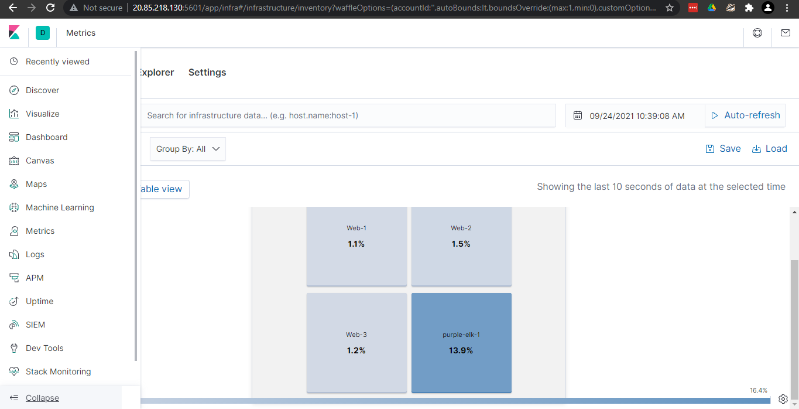

  - Click on one of your VMs and select `View Metrics`

    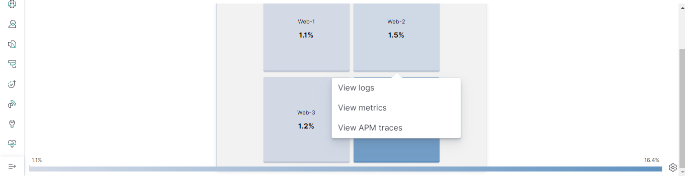

  - Here you can adjust the time frame in the upper righthand section of the screen to make the cpu spike more visible, I set mine to the last 10 minutes. You can see in the chart that the CPU was indeed at 100% usage for 2 minutes

    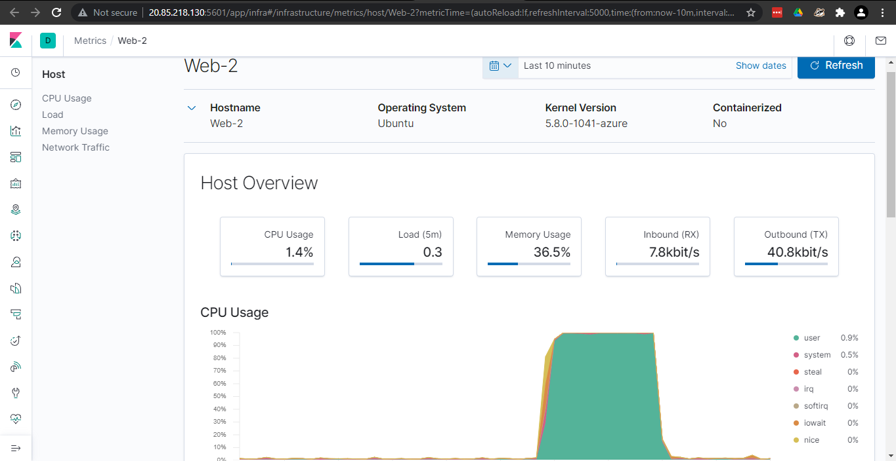
    
If you would like to try some other attacks see the files in the Linux directory of this repository. It contains scripts that will preform an SSH barrage or a light wget DOS attack. To use them simply add your Web VM's IP addresses to the top of the file just as you did for the hosts file earlier. They can be run from your Ansible container or directly from your Jump-Box-Provisioner VM
