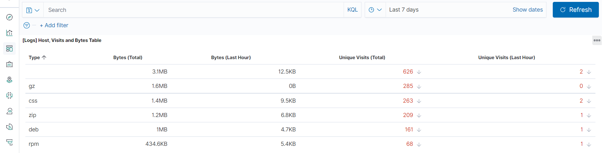
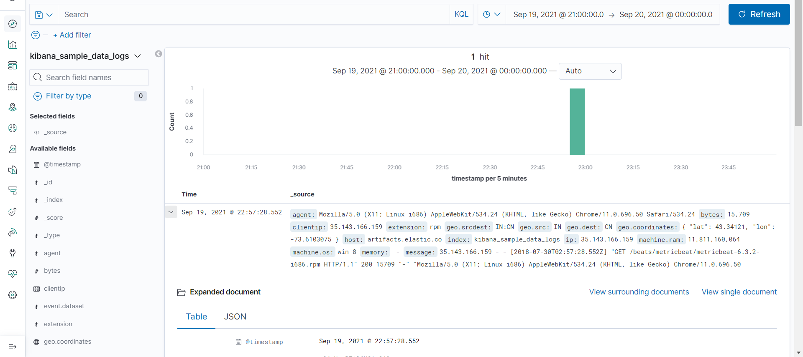

## 1. Add the sample web log data to Kibana.

- To add logs do the following steps:

     - Go to Kibana home page: 
       ```bash 
       http://$Kibana__Public_Ip_Address/app/kibana
       ```
     - Under "Sample Data" click "Load a data set and a Kibana dashboard"
     - Select "Add Data" in the Web Logs panel

## 2. Answer the following questions:

- In the last 7 days, how many unique visitors were located in India?
  
  *There were 806 unique visitors from India in the last 7 days*
  

- In the last 24 hours, of the visitors from China, how many were usingMac OSX?

  *In the last 24 hours there were 8 visitors using Mac OSX from China.*
  

- In the last 2 days, what percentage of visitors received 404 errors? How about 503 errors?

  *In the last 2 days, 4.762% of visitors received 404 errors and 4.762% received 503 errors.*
  

- In the last 7 days, what country produced the majority of the traffic on the website?

  *In the last 7 days China produced the majority of the network traffic at 19.5%. (followed closely by India at 17.4%)*
  

- Of the traffic that's coming from that country, what time of day had the highest amount of activity?

  *The highest amount of traffic coming from CN happened at 13:00 with 39 requests. (followed closely by CN at 12:00 with 38 requests)*
  


- List all the types of downloaded files that have been identified for the last 7 days, along with a short description of each file type (use Google if you aren't sure about a particular file type).

     - gz  :  a type of compressed file or folder generally used with linux
     - css :  a style sheet for the website
     - zip :  a type of compressed file or folder generally used with windows
     - deb :  a type of installation file for Debian based linux distributions
     - rpm : this is a type of installation file for Red Hat based linux distributions

     

## 3. Now that you have a feel for the data, Let's dive a bit deeper. Look at the chart that shows Unique Visitors Vs. Average Bytes.

- Locate the time frame in the last 7 days with the most amount of bytes (activity).

     *September 19, 2021 had the highest activity at around 21:00.*
     
     
- In your own words, is there anything that seems potentially strange about this activity?

     - There is a very large download (15709 bits) from one user within a minute.
     Other times of high traffic (8,500 bits) are usually spread out across several minutes and have several users making up that traffic   

## 4. Filter the data by this event.

- What is the timestamp for this event?

     - Sep 19, 2021 @ 22:57:28.552

 - What kind of file was downloaded?
      
     - An RPM file was downloaded.

- From what country did this activity originate?

     - This activity originated in India.

- What HTTP response codes were encountered by this visitor?

     - There were no errors encountered by this visitor so they received code 200.

## 5. Switch to the Kibana Discover page to see more details about this activity.

  *Be sure to expand the info with the small arrow next to the date for detailed information*
  

- What is the source IP address of this activity?

     - 35.143.166.159

- What are the geo coordinates of this activity?

     - The geo.srcdst is IN:CN

- What OS was the source machine running?

     - The OS of the source machine was Windows 8.

- What is the full URL that was accessed?

     - https://artifacts.elastic.co/downloads/beats/metricbeat/metricbeat-6.3.2-i686.rpm

- From what website did the visitor's traffic originate?

     - http://facebook.com/success/jay-c-buckey

## 6. Finish your investigation with a short overview of your insights. 

- What do you think the user was doing?

     - It seems the user was following a guide on facebook to install metricbeat and clicked the download link on the page.

- Was the file they downloaded malicious? If not, what is the file used for?

     - The user downloaded an installation file for metricbeat. Assuming the sha256 matches the one from elastic.co it is not malicious.
     However, this file is not useful for this user since they are running Windows 8 and the file they downloaded is used to install software onto Red Hat based operating systems.

- Is there anything that seems suspicious about this activity?

     - Looking at other traffic from this source IP address over the last 7 days you can see that this user seems to be following facebook advice for using or installing metricbeat (later it seems they switched interest to astronauts). While this isn't specifically suspicious it could indicate a few things:
     
       1. This user is trying to get into the cyber security field. I find this to be the most likely. 
       The two facebook urls they visited indicate success stories or guides. 
       2. This user is trying to learn how to exploit metricbeat.
       This is unlikely because the originating facebook url seems to indicate it is a guide for success in the industry.
       3. This user is already in the cyber security field and is trying to deploy metricbeat for their employer.
       If this is the case, this user needs to be trained in best practices/compliance guidelines for deploying software.

- Is any of the traffic you inspected potentially outside of compliance guidelines?

     - It is not recommended to browse facebook on work machines, let alone click on download links from anywhere other than the official website's domain.
     If this user was not an administrator they should not be trying to download or install software without previous approval from admins.
     If they were running a linux machine it would be recommended to only download software through official repositories instead of using a web browser.